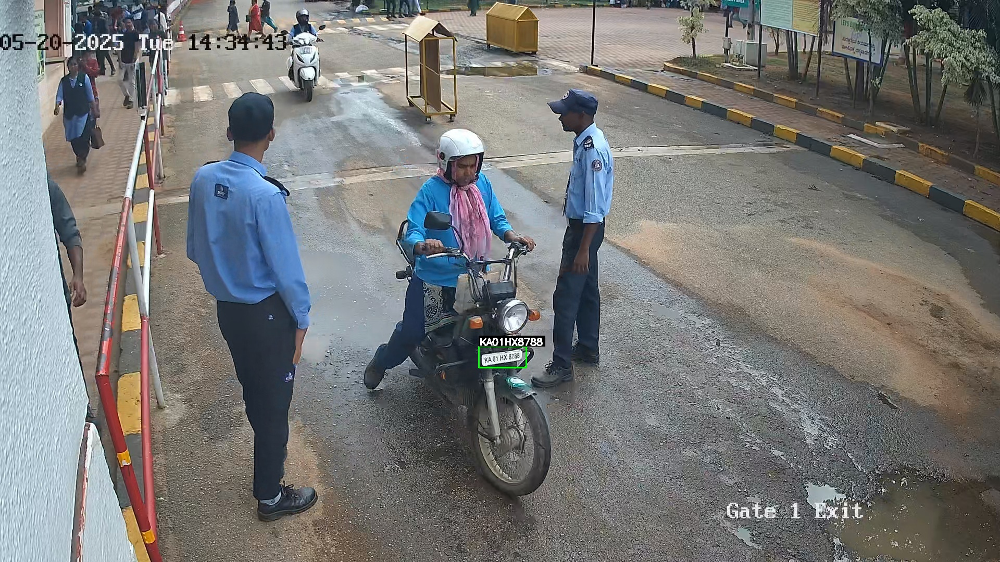
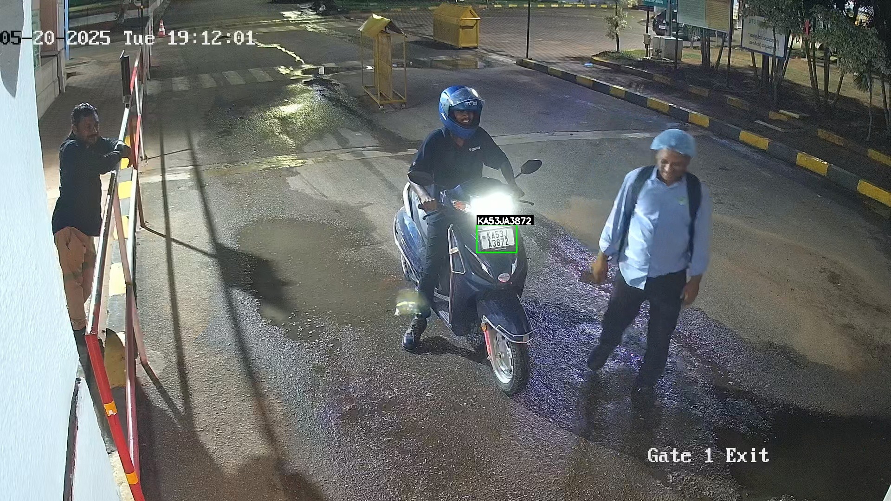
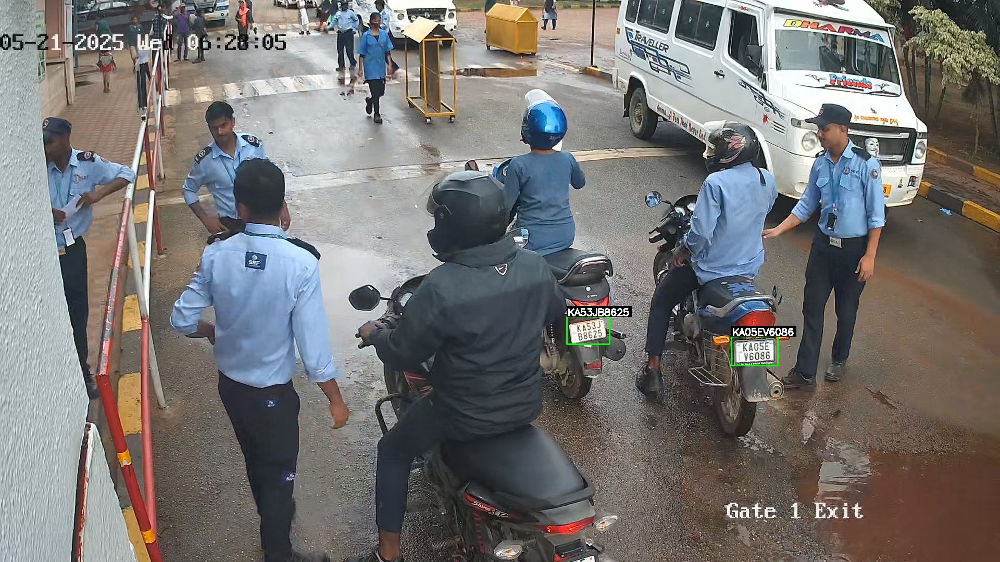
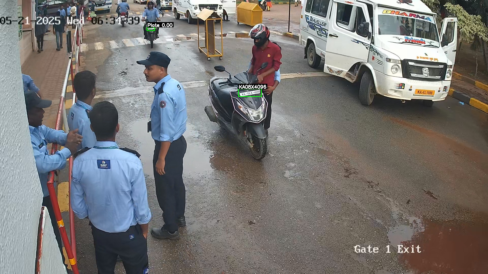
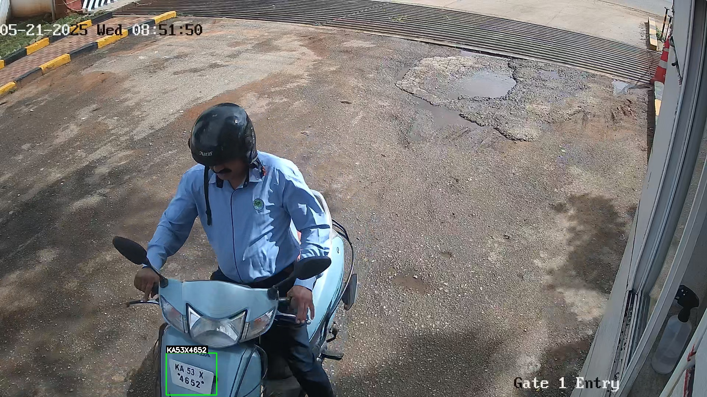
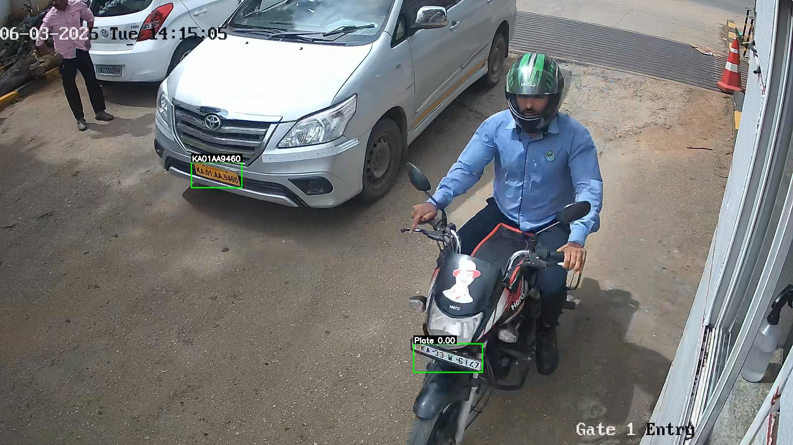
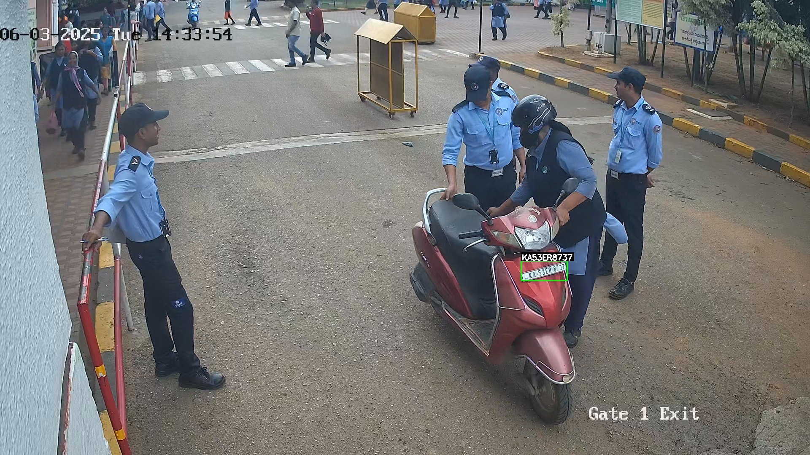

# 🚗 Automatic Number Plate Recognition (ANPR) – Real-Time AI Video Analytics

## 📌 Project Summary
This project implements a **production-grade Automatic Number Plate Recognition (ANPR) system** for real-time vehicle monitoring at entry and exit points.  
The system is designed for **24×7 continuous operation** using **GPU-accelerated video analytics** and is suitable for **industrial plants, parking facilities, and gated premises**.

The pipeline processes live **RTSP camera streams**, performs **vehicle and license plate detection using NVIDIA DeepStream**, and applies **OCR-based plate recognition with PaddleOCR**, achieving **high accuracy even under challenging real-world conditions**.

---

## 🎯 Key Metrics & Performance
- **Inference Speed**: 25–30 FPS per camera stream
- **OCR Accuracy**: Improved from ~72% → **92–95%**
- **False Positives Reduction**: ~65–75%
- **End-to-End Latency**: ~150–200 ms per vehicle event
- **Vehicle Speed Handling**: Reliable up to ~30–40 km/h
- **Deployment Mode**: Real-time, multi-stream, GPU-accelerated

---

## 🧠 Project Overview
The system ingests **live RTSP streams** and performs:
1. **Vehicle & License Plate Detection** using NVIDIA DeepStream
2. **Dynamic cropping** of detected license plates
3. **OCR text extraction** using PaddleOCR
4. **Event logging** with metadata:
   - Recognized plate number
   - Timestamp
   - Camera location
   - OCR confidence score
   - Snapshot image

All vehicle events are stored in a **structured, audit-ready format**, enabling:
- Security monitoring
- Automated access control
- Compliance and forensic auditing

---

## ⚠️ Challenge: PaddleOCR in Real-World Conditions
While PaddleOCR performed well on clean images, significant challenges were observed in **live streaming environments**:

- Night-time glare & uneven illumination  
- Rain reflections and low-contrast plates  
- Motion blur from fast-moving vehicles  
- Angled camera views & non-standard fonts  

### Initial Issues Observed
- Character-level accuracy dropped to **~70–75%**
- Duplicate OCR results across consecutive frames
- Partial reads and low-confidence outputs cluttered logs

---

## 🛠️ Solution Approach & Technical Optimizations

To stabilise OCR performance, a **multi-stage preprocessing and intelligence layer** was implemented.

### 🔹 Pre-processing Enhancements
- CLAHE-based contrast enhancement
- Noise reduction & glare suppression
- Dynamic plate cropping from detection outputs
- Perspective correction for skewed or angled plates

### 🔹 Post-processing & Intelligence Layer
- Confidence thresholding to discard unreliable OCR outputs
- Regex-based validation and character cleanup
- Similarity matching to suppress near-duplicate reads
- Temporal filtering to trigger OCR only on best-quality frames

---

## 📈 Measured Improvements (Post-Optimization)
| Metric | Before | After |
|------|-------|------|
| OCR Accuracy | ~72% | **92–95%** |
| False Positives | High | **↓ 65–75%** |
| OCR Confidence Stability | Low | **↑ ~40%** |
| FPS per Stream | 25–30 | **Maintained** |
| Latency | ~200 ms | **150–200 ms** |

---

## ✅ Final Solution Delivered
The final system is a **robust, scalable, and production-ready ANPR pipeline** capable of operating reliably under:
- Low-light and night-time conditions
- Rain and reflective environments
- Motion blur and angled camera placements

It produces **clean, duplicate-free vehicle logs** with full traceability:
- Timestamped events
- Camera identifiers
- OCR confidence scores
- Image evidence

This makes the solution suitable for **security auditing, automated access control, and compliance tracking**.

---

## 🔄 End-to-End Pipeline (High-Level Flow)

```text
RTSP Camera Stream
        ↓
DeepStream Vehicle & Plate Detection (25–30 FPS)
        ↓
Dynamic Plate Cropping
        ↓
Image Preprocessing
(CLAHE, Denoising, Glare Removal, Angle Correction)
        ↓
PaddleOCR Text Recognition (92–95% Accuracy)
        ↓
Post-processing
(Confidence Filtering, Regex Cleanup, Duplicate Suppression)
        ↓
Structured Logging + Snapshot Storage


## Pipeline Workflow
Input: Folder of images from surveillance or ANPR setup.
YOLOv5 Detection:
Detects license plates using a trained YOLOv5 model.
Extracts bounding boxes of plates.
OCR using PaddleOCR:
Applies text detection and recognition on the cropped plates.
Filters text based on confidence threshold (≥ 0.8).
Regex-based Post-processing:
Cleans detected text: removes noise characters (° " - . space).
Converts confusing characters (e.g., 'O' → '0').
Applies regex validation for Indian license plate formats.
Output:
Annotated images with bounding boxes and recognized text.
Saved to output folder with logs of OCR confidence and regex matches.

I have passed parameters to paddleocer to manage and text angle.









